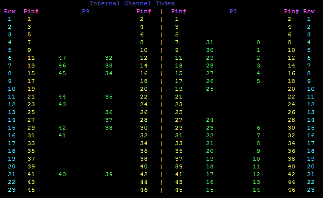
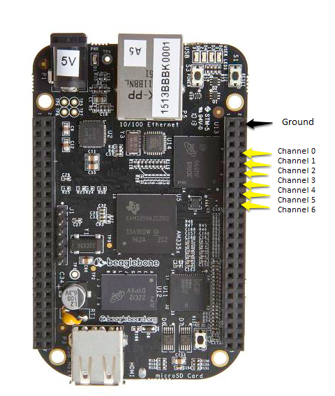

Overview
========
LEDscape is a library and service for controlling individually addressable LEDs from a 
Beagle Bone Black or Beagle Bone Green using the onboard [PRUs](http://processors.wiki.ti.com/index.php/Programmable_Realtime_Unit_Subsystem). It currently supports WS281x 
(WS2811, WS2812, WS2812b), WS2801 and initial support for DMX. 

It can support up to 48 connected strings and can drive them with very little load on the main processor. 

Background
------
LEDscape was originally written by Trammell Hudson (http://trmm.net/Category:LEDscape) for
controlling WS2811-based LEDs. Since his original work, his version (https://github.com/osresearch/LEDscape)
has been repurposed to drive a different type of LED panel (e.g. http://www.adafruit.com/products/420).

This version of the library was forked from his original WS2811 work. Various improvements have been made in the 
attempt to make an accessible and powerful LED driver based on the BBB. Many thanks to Trammell for his excellent work
in scaffolding the BBB and PRUs for driving LEDs.


Installation
=====================================
It is necessary to have access to a shell onto the Beaglebone using serial, Ethernet, or USB connections.  
Examples on how to do this can be found at [BeagleBoard.org](http://beagleboard.org/getting-started) or at
[Adafruit's Learning Site](https://learn.adafruit.com/ssh-to-beaglebone-black-over-usb/ssh-on-mac-and-linux).

###Start with a compatible Linux image

To use LEDscape, you must use a version of the Linux kernel that supports the `uio_pruss` module. The Beaglebone.org Wheezy Linux images work well. 

####Checking existing Linux version

Check which Debian version you are currently running by entering...

```
cat /etc/debian_version
```

This `README` was tested with version `7.11`, but any 7.x version should work. Version 8.x is currently not compatible because it does not support the PRUSS subsystem that LEDScape used to talk to the PRU units. 

####Installing a compatible Linux version

If you have an incompatible version currently installed or just want to start with a clean install of to the most recent compatible version, you can follow the instructions here under "Update board with latest software"...

http://beagleboard.org/getting-started

Make sure you pick a "Wheezy" version of the Linux kernel since the "Jessie" versions do not yet work by default. This readme was tested against the "Debian 7.11 2015-06-15 4GB SD LXDE" image. 

###Installing the LEDscape software

Log into a compatible Linux version as root and enter the following commands at a command line...

	git clone git://github.com/Yona-Appletree/LEDscape
	cd LEDscape
	chmod +x install-software.sh
	./install-software.sh
	reboot
	
This will do the following....

1. Clone the LEDscape repository to your local machine in a directory called "LEDscape" under whatever directory you started in.
3. Make the install script executable.
2. Build the LEDscape software from the sources. This takes a couple of minutes and you will see lots of scrolling. 
3. Copy the new flattened device tree files to your `/boot` directory. These files enable the PRU subsystem.  Note that the old files are backed up with the extension `preledscape_bk`.
4. Copy a default config file to `/etc/ledscape-config.json` if that file does not already exist. 
4. Install the `uio_pruss` kernel module to let LEDscape talk to the PRU subsystem. 
5. Reboot the machine.

###Updating an existing install

If you are using an older version of LEDscape that keeps the configuration in a JSON file inside the LEDscape directory, you should copy your modified config to `/etc/ledscape-config.json`.  

You should be able to update an existing install with the above procedure without overwriting your configuration in `/etc/ledscape-config.json`. 

Note that the install process will not preserve any modified pin mappings.
 
###Testing the install

Once the machine has rebooted, log in as root, enter the following commands to switch into the `LEDscape` directory you created above and manually start the LEDscape server...

```
cd LEDscape
./run-ledscape
```

It should print some diagnostic messages and continue running until you press Control-C or logout or reboot. 

By default, the server starts sending a demo pattern in the WS2812B format on the output pins. If you connect the `DI` of some strings to these pins, they should light up.  Pins P8-8, P8-10, P8-12, P8-14, P8-16, and P8-18 are great for testing since they are located near a ground on pin P8-2, they are all right next to each other, and they should always have pixel data in the default configuration. 
###Setting the server to run automatically as a service

If you want LEDscape to automatically start every time the machine is rebooted, you can install it as a service with the following command (run from a command line inside the LEDscape directory as root)...

	sudo ./install-service.sh
	

Open Pixel Control Server
=========================

##Configuration
	
By default LEDscape is configured for strings of 256 WS2811 pixels, accepting OPC
data on port 7890. You can adjust this by editing `run-ledscape` and 
editing the parameters to `opc-server`


##Data Format

The `opc-server` server accepts data on OPC channel 0. It expects the data for
each LED strip concatenated together. This is done because LEDscape requires
that data for all strips be present at once before flushing data data out to
the LEDs. 

`opc-server` supports both TCP and UDP data packets. The TCP port is specified with `--tcp-port <port>` and the UDP port
with `--udp-port <port>`. Entering `0` for a port number will disable that server.
 
Note that if using the UDP server, `opc-server` will limit the number of pixels to 21835, or 454 pixels per port if
using all 48 ports.

##Output Modes

LEDscape is capable of outputting several types of signal. By default, a ws2811-compatible signal is generated. The
output mode can be specified with the `--mode <mode-id>` parameter. A list of available modes and their descriptions
can be obtained by running `opc-server -h`. 

Frame Rates for WS2812 Leds
-----------
	512 per channel ~= 060 fps
	256 per channel ~= 120 fps
	128 per channel ~= 240 fps
	064 per channel ~= 400 fps

Pin Mappings
------------
Each output mode of LEDscape is compatible with several different pin mappings. These pin-mappings are declared in
`pru/mappings` as json files and each contain information about the mapping. They can be provided to LEDscape with the
`--mapping <mapping-id>` parameter, where `<mapping-id>` is the filename of the json file without it's extension.

The mappings are designed for use with various different cape configurations to simplify the hardware designed.
Additional mappings can be created by adding new `json` files to the `pru/mappings` directory and rebuilding.

A human-readable pinout for a mapping can be generated by running

    node pru/pinmap.js --mapping <mapping-id>
    
###Default pin mappings

By default, LEDscape is set up to drive 48 strings of WS2812B LEDs, with each string having up to 600 pixels. You can connect shorter strings with no problems except that the update rate will be slower. If you connect longer strings, only the first 600 pixels will update. 

Here is the default mapping of channels (in green) to pins...




Here are the default pin assignments for the first 6 channels so you can get your bearings...



These are the pins you would connect the to each string's `DI` (Data In).

###HDMI conflict

#### BeagleBone Green
The BeagleBone Green has no HDMI port, so all 48 channels are available on the mapped pins by default. 

In fact, if you try to do the edit below you can make the board unbootable!

#### BeagleBone Black
On the BeagleBone Black, the HDMI port uses pins P8-27 through P8-46 so these channels (basically the bottom half of the right header) will not be usable for pixel data by default. If you need less than 28 channels total, you can just use pins that are not assigned to the HDMI port. 

If you want to use the pins assigned to the HDMI port for pixel data, then you will need to disable the HDMI port by entering the command...

```
nano /boot/uEnv.txt
```

Find the lines that say...

```
##BeagleBone Black: HDMI (Audio/Video) disabled:
#dtb=am335x-boneblack-emmc-overlay.dtb
```

...and change them to say...

```
##BeagleBone Black: HDMI (Audio/Video) disabled:
dtb=am335x-boneblack-emmc-overlay.dtb
```

(delete the `#` at the beginning of the second line).

Then save the file by pressing `Control-X` and answering `y`, and then reboot by entering `reboot`.

When the board comes back up, the HDMI should be disabled and the pins available for LEDs. 


Multi-Pin Channels
------------------
Some mappings, such as ws2801, use multiple pins to output each channel. In these cases, fewer than the full 48 channels
are available. In the case of ws2801, each channel uses two pins, DATA on the first pin and CLOCK on the next. Only 24
channels of output are available and to reduce CPU usage, `opc-server` should be called with `--strip-count 24` or
lower.


Output Features
---------------
`opc-server` supports Fadecandy-inspired temporal dithering and interpolation
to enhance the smoothness of the output data. By default, it will apply a
luminance curve, interpolate and dither input data at the highest framerate
possible with the given number of LEDs.

These options can be configured by command-line switches that are documented in the help output from `opc-server -h`.

To disable all signal enhancements, use `opc-server -lut`

Demo Modes
--------------
`opc-server` supports several demo modes that will drive the attached pixels autonomously. This can help greatly with testing.

The demo mode is set using the `demoMode` parameter and can have the following values...

| demoMode | behavior
|----------|----------|
|none      |No demo running. Pixels will only update in response to incoming OPC packets|
|id        | Set the pixel to the strip index unless the pixel has the same index as the strip, then light it up grey with bit value: 1010 1010|
|fade      | Display a pleasing pattern of rotating color hues with a border that steps across the pixels every 12 seconds |
|black     | All pixels off|
|power     | All pixels on full white (based on current settings)- good for testing for maximum power requirements for current settings |

The default `demo-mode` set in the supplied `ws281x-config.json` configuration file is `fade`.

Note that received OPC data will override any currently running `demo-mode`.  The currently running `demo-mode` will resume display 5 seconds after the last OPC data is displayed. 

Configuration
====

Config info is typically stored in `/etc/ledscape-config.json`.

##Default config

The default config after installation is set up to drive WS281X strips connected to all of the 48 available output pins. Note that not all pins will work on BeagleBone Black unless you [disable the HDMI port](#HDMI Conflict).  

A description of the file format and some example configurations are available in the [`configs/` subdirectory](/configs) of this repo. 

##Directly editing the current config

You can edit the config file directly by typing...

```
nano /etc/ledscape-config.json
```

If the server is already running as a service, you'll need to enter the following command to get it to read the new config file...

```
sudo systemctl restart ledscape.service
```


Processing Examples
========

LEDscape provides versions of the FadeCandy processing examples modified to work better with LEDscape in the
`processing` directory. Clone this repo on a computer and run these sketches, edited to point at your BBB hostname or
ip address after starting `opc-server` or installing the system service.


Hardware Tips
========

Remember that the BBB outputs data at 3.3v. Depending on the specific LED strips, it is often possible to connect the `DI` on directly to one of the output pins on the BeagleBone, especially if the strips are high quality and the connecting wire is short. Many [recommend](https://forum.pjrc.com/threads/24648-Newbie-findings-re-WS281X-signal-quality(wire-length-resistors-and-grounds-Oh-my!) also adding an impedance  matching resistor to smooth out the signal. 

If your strips require 5V on `DI`, you will need to use a level-shifter of some sort. [Adafruit](http://www.adafruit.com/products/757) has a decent one which works well.  For custom circuit boards we recommend the [TI SN74LV245](http://octopart.com/partsearch#!?q=SN74LV245).

While there may be others, RGB123 makes an excellent 24/48 pin cape designed 
specifically for this version of LEDscape: [24 pin](http://rgb-123.com/product/beaglebone-black-24-output-cape/) or [48 pin](http://rgb-123.com/product/beaglebone-black-48-output-cape/)


API
===

`ledscape.h` defines the API. The key components are:

	ledscape_t * ledscape_init(unsigned num_pixels)
	ledscape_frame_t * ledscape_frame(ledscape_t*, unsigned frame_num);
	ledscape_draw(ledscape_t*, unsigned frame_num);
	unsigned ledscape_wait(ledscape_t*)

You can double buffer like this:

	const int num_pixels = 256;
	ledscape_t * const leds = ledscape_init(num_pixels);

	unsigned i = 0;
	while (1)
	{
		// Alternate frame buffers on each draw command
		const unsigned frame_num = i++ % 2;
		ledscape_frame_t * const frame
			= ledscape_frame(leds, frame_num);

		render(frame);

		// wait for the previous frame to finish;
		ledscape_wait(leds);
		ledscape_draw(leds, frame_num);
	}

	ledscape_close(leds);

The 24-bit RGB data to be displayed is laid out with BRGA format,
since that is how it will be translated during the clock out from the PRU.
The frame buffer is stored as a "strip-major" array of pixels.

	typedef struct {
		uint8_t b;
		uint8_t r;
		uint8_t g;
		uint8_t a;
	} __attribute__((__packed__)) ledscape_pixel_t;

	typedef struct {
		ledscape_pixel_t strip[32];
	} __attribute__((__packed__)) ledscape_frame_t;


Low level API
=============

If you want to poke at the PRU directly, there is a command structure
shared in PRU DRAM that holds a pointer to the current frame buffer,
the length in pixels, a command byte and a response byte.
Once the PRU has cleared the command byte you are free to re-write the
dma address or number of pixels.

	typedef struct
	{
		// in the DDR shared with the PRU
		const uintptr_t pixels_dma;

		// Length in pixels of the longest LED strip.
		unsigned num_pixels;

		// write 1 to start, 0xFF to abort. will be cleared when started
		volatile unsigned command;

		// will have a non-zero response written when done
		volatile unsigned response;
	} __attribute__((__packed__)) ws281x_command_t;

Reference
==========
* http://www.adafruit.com/products/1138
* http://www.adafruit.com/datasheets/WS2811.pdf
* http://processors.wiki.ti.com/index.php/PRU_Assembly_Instructions
